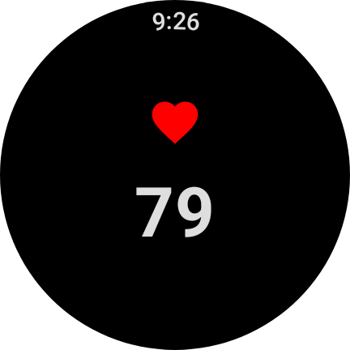
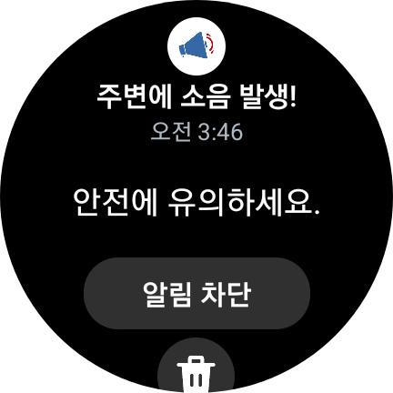

# [안전 귀가 드론 서비스] WINGWING   

드론을 활용한 안전 귀가 지원부터, 위험 상황 감지 및 비상 신고까지!   
스마트 치안을 실현하는 귀가 동행 서비스

> 2024.10.14 ~ 2024.11.19 (5주)

# 기능 소개
## 핵심 기능
1. 사용자 탐지 및 추적
2. 실시간 모니터링 및 위험 상황 감지
3. 비상 프로세스 수행

## 세부 기능

### **1. 위험 감지 및 경고 알림**
- **기능 설명**: 사용자가 위험 상황에 처했을 때, 소음, 심박수, 거리 등의 데이터를 기반으로 위험을 실시간으로 감지하고 경고 알림을 전송합니다.

| **앱 알림**                  | **워치 알림**             |
|-----------------------------|--------------------------|
|  |  |

---
### **2. 사용자 인식 및 실시간 추적**
- **기능 설명**: 카메라를 기반으로 사용자를 인식하고 실시간으로 사용자를 추적합니다.

| **드론 시작**               | 
|-----------------------------|
| | 

|  **사용자 탐지**             | **사용자 추적**             |
|--------------------------|----------------------------|
|||

---

### **3. 위험 판단 및 대응 프로세스**
- **기능 설명**: 위험 상황이 발생하면 즉시 판단하여 경고음을 작동하고 최적의 대응 경로를 제공합니다.

| **위험 감지**               | **심박수 기반 경고**       | **소음 기반 경고**          |
|-----------------------------|--------------------------|----------------------------|
|  |   |  |

---

### **4. 비상 상황 대응**
- **기능 설명**: 사용자가 위험에 처하면 비상 프로세스를 작동하여 신고를 트리거하고, 경고음과 위치 정보를 실시간으로 보호자에게 전송합니다.

| **SNS 경고 공유**            |
|-----------------------------|
| |

# **프로젝트 구조**
- **shieldroneapp**: 클라이언트 앱과 워치 앱을 담당하는 프로젝트
  - 사용자 인터페이스(UI)
  - 사용자와 상호작용하는 주요 로직 포함
  - 모바일 및 웨어러블 (갤럭시 워치)

- **shieldrone-main-server**: 메인 서버 프로젝트
  - 드론과 유저 관리를 위한 서버
  - 데이터 관리, API 제공, 클라이언트와 드론 간 통신 지원

- **shieldrone-station-app**: 드론 제어 프로젝트
  - 드론의 실시간 제어 로직
  - 드론 상태 모니터링 및 경로 설정 기능 포함

- **shieldrone-station-pc**: 드론 서버 프로젝트
  - 드론 및 클라이언트로부터 수신된 데이터를 기반으로 위험 상황 판단
  - 위험 감지 로직 및 데이터를 클라이언트로 송신
  - GPS 및 센서 데이터를 활용하여 사용자의 실시간 위치를 추적
  - 드론의 제어 명령을 생성하고, 실시간 이동 및 경로 조정을 지원

 

# **팀 소개**

|  |  |  |  |  |  |
| :----------------------------------------------------------------------------------------: | :----------------------------------------------------------------------------------------: | :-----------------------------------------------------------------------------------------: | :----------------------------------------------------------------------------------------: | :----------------------------------------------------------------------------------------: | :----------------------------------------------------------------------------------------: |
|         [강한나 @hannabananah](https://github.com/hannabananah) `FRONTEND`          |                 [김준혁 @pv104](https://github.com/pv104) `BACKEND`                 |              [박희연 @hi-react](https://github.com/hi-react) `FRONTEND`              |     [서종원 @styughjvbn](https://github.com/styughjvbn) `BACKEND` `LEADER`      |        [전정민 @Gutsssssssssss](https://github.com/Gutsssssssssss) `BACKEND`        |               [최소현 @soddong](https://github.com/soddong) `BACKEND`               |

